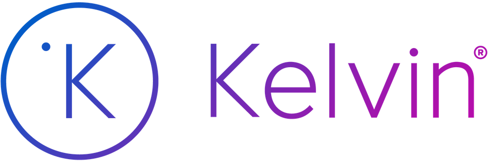

# Welcome to Kelvin SDK - App Samples
This repository contains sample applications that demonstrate how to use the **Kelvin SDK**. 

We recommend that you start first by reading the official Kelvin Documentation on https://docs.kelvin.ai.

# Applications

| Application | Type | Level | Description |
| ----------- | ---- | ----- | ----------- |
| [Azure Data Lake Gen2 Uploader](azure-data-lake-uploader/) | Data Uploader | Intermediate | Uploads streaming data to Azure Data Lake Storage Gen2. |
| [Casting Defect Detection using Computer Vision](casting-defect-computer-vision/) | Computer Vision | Intermediate | Leverages computer vision and a Tensorflow-based model to identify and analyze manufacturing defects in casting processes. |
| [CSV Stream Publisher](csv-stream-publisher/) | CSV Stream Publisher | Beginner | Ingests Data from a CSV file and publishes it to the Kelvin platform. |
| [Databricks Delta Table](databricks-delta-table/) | Connector | Intermediate | Establishes a connection with a DataBricks Delta Table and generates Kelvin Recommendations at regular intervals. |
| [Event Detection](event-detection/) | Event Detection | Beginner | Monitors streaming data to detect and respond to events exceeding pre-set thresholds by emitting a Control Change output. |
| [Event Detection (Complex)](event-detection-complex/) | Event Detection | Intermediate | Monitors streaming data to detect and respond to events exceeding pre-set thresholds by emitting a Control Change or Recommendation output. This example also leverages Asset Parameters and App Configuration to make the application more dynamic. |
| [Multi-Objective Optimization ML](multi-objective-optimization-ml/) | Machine Learning | Intermediate | Implements a multi-objective optimization problem using machine learning techniques. |
| [Rolling Window DataFrame](rolling-window-dataframe/) | Rolling Window | Beginner | Demonstrates the creation of a rolling window using Pandas to manage and analyze time-series data effectively. |

# Contributing
1. Fork the project.
2. Create your feature branch (git checkout -b feature/YourFeature).
3. Commit your changes (git commit -m 'Add some feature').
4. Push to the branch (git push origin feature/YourFeature).
5. Open a pull request.
