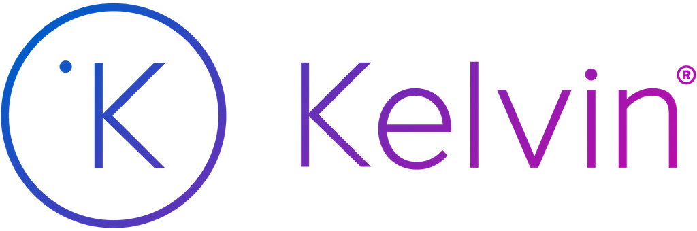

# Welcome to Kelvin SDK - App Samples
This repository contains sample applications that demonstrate how to use the **Kelvin SDK**.

Start with the official [Kelvin Documentation](https://docs.kelvin.ai).

# Sample Applications

## 🚀 SmartApps

| Application                                                                      | Domain               | Level        | Description                                                                                         |
|--------------------------------------------------------------------------------- |----------------------|--------------|-----------------------------------------------------------------------------------------------------|
| [Casting Defect Detection](applications/casting-defect-detection/)               | Computer Vision      | Advanced     | Uses a TensorFlow-based model to identify and analyze manufacturing defects in casting processes.   |
| [Event Detection](applications/event-detection/)                                 | Event Detection      | Beginner     | Monitors streaming data for threshold-crossing events and emits Control Changes or Recommendations. |
| [Multi-Objective Optimization ML](applications/multi-objective-optimization-ml/) | Machine Learning     | Advanced     | Solves multi-objective optimization problems using ML techniques.                                   |
<<<<<<< HEAD
=======
| [Slack Message Test](applications/slack-message-test/)                           | Custom Actions       | Beginner     | Publishes a Slack Message custom action every minute to test the Slack Custom Actions exporter.     |
| [Teams Message Test](applications/teams-message-test/)                           | Custom Actions       | Beginner     | Publishes a Teams Message custom action every minute to test the Microsoft Teams Sender exporter.   |
>>>>>>> ac2f3fe (added microsoft-teams-sender exporter)

## 📥 Importers

| Application                                     | Level        | Description                                          |
|-------------------------------------------------|--------------|------------------------------------------------------|
| [Camera Connector](importers/camera-connector/) | Intermediate | Publishes camera-feed images to the Kelvin Platform. |
| [MQTT Connector](importers/mqtt-connector/)     | Intermediate | Publishes MQTT messages to the Kelvin Platform.      |

## 📤 Exporters

| Application                                                                   | Level         | Description                                             |
|-------------------------------------------------------------------------------|---------------|---------------------------------------------------------|
| [AWS S3 Uploader](exporters/aws-s3-uploader/)                                 | Intermediate  | Uploads time-series data to an AWS S3 Bucket.           |
| [Azure Data Lake Gen2 Uploader](exporters/azure-data-lake-uploader/)          | Intermediate  | Uploads streaming data to Azure Data Lake Storage Gen2. |
| [Databricks Delta Table Uploader](exporters/databricks-delta-table-uploader/) | Intermediate  | Uploads streaming data to Databricks Delta Table.       |
| [Databricks Volume Uploader](exporters/databricks-volume-uploader/)           | Intermediate  | Uploads streaming data to a Databricks Volume.          |
<<<<<<< HEAD
=======
| [Databricks Volume Uploader](exporters/databricks-volume-uploader/)           | Intermediate  | Uploads streaming data to a Databricks Volume.          |
| [Microsoft Teams Sender](exporters/microsoft-teams-sender/)                   | Intermediate  | Sends Microsoft Teams messages to a given channel.      |
>>>>>>> ac2f3fe (added microsoft-teams-sender exporter)
| [Resnet Custom Actions](exporters/resnet-custom-actions/)                     | Intermediate  | Creates issues in the Resnet system.                    |
| [Slack Custom Actions](exporters/slack-custom-actions/)                       | Intermediate  | Sends slack messages to a given channel.                |

## 🤖 Docker

| Application                              | Level        | Description                                            |
|------------------------------------------|--------------|--------------------------------------------------------|
| [Mosquitto MQTT](docker/mqtt-mosquitto/) | Intermediate | Mosquitto MQTT Broker that supports SSL/TLS encryption |

# Running Samples Locally

Each sample is self-contained: its own `requirements.txt`, `Dockerfile`, and `app.yaml`.
We use [uv](https://docs.astral.sh/uv/) to install the `kelvin` CLI and to run each app in an
isolated environment built from its existing `requirements.txt`. This doesn't change how apps
build and run on Kelvin.

Two packages are involved, each with a different job:

| Package             | Role                                              | Where it lives                |
|---------------------|--------------------------------------------------|-------------------------------|
| `kelvin-sdk`        | The `kelvin` CLI to build, test, and deploy apps | Installed once, globally      |
| `kelvin-python-sdk` | The runtime library each app imports             | Each app's `requirements.txt` |

All samples target **Python 3.13**.

## Prerequisites

Install [uv](https://docs.astral.sh/uv/getting-started/installation/), then install the Kelvin
CLI once, globally:

```bash
uv tool install kelvin-sdk     # provides the `kelvin` command
kelvin --version               # verify it's on your PATH
```

Upgrade it later with `uv tool upgrade kelvin-sdk`.

## Run a sample

From inside any app folder:

```bash
cd exporters/aws-s3

uv venv --python 3.13              # create an isolated environment
uv pip install -r requirements.txt # install kelvin-python-sdk + the app's deps
uv run python main.py              # run the app
```

`uv run` auto-detects the local `.venv`, so there's no need to activate it. After setup,
re-running an app is just `uv run python main.py`.

To feed an app simulated data, open a second terminal and use the CLI:

```bash
kelvin app test simulator
```

To skip keeping a `.venv`, run the app ephemerally; uv builds a throwaway
environment each time:

```bash
uv run --python 3.13 --with-requirements requirements.txt python main.py
```

# Contributing

Please read our [Style Guide](CONTRIBUTING.md) before contributing a new sample application.

1. Fork the project.
2. Create your feature branch (git checkout -b feature/YourFeature).
3. Follow the [Style Guide](CONTRIBUTING.md) for folder structure, naming conventions, and code style.
4. Commit your changes (git commit -m 'Add some feature').
5. Push to the branch (git push origin feature/YourFeature).
6. Open a pull request.