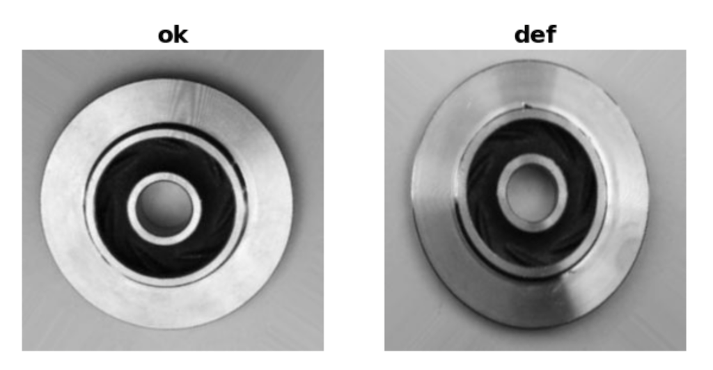
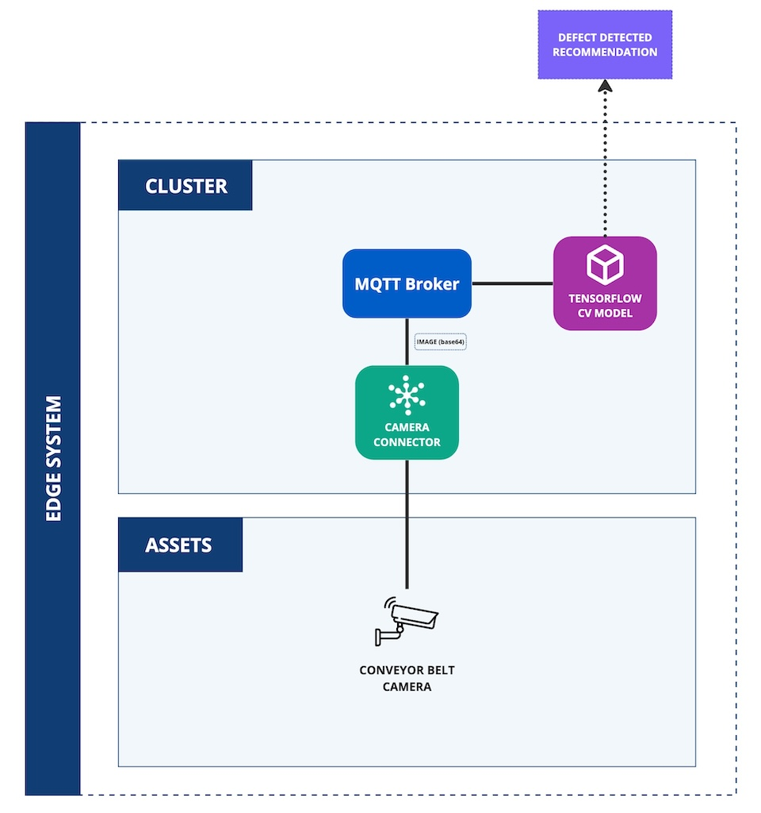

# Casting Defect Detection
This application demonstrates the use of the Kelvin SDK for detecting casting defects with a computer-vision model.



The solution has two parts:

1. **Image Feed (`../../importers/image-feed`):** simulates a camera and publishes each frame to Kelvin as a `camera-image` object. In production it would read a live camera feed.
2. **Casting Defect Detection:** classifies each image with a pre-trained TensorFlow model and recommends a fault back to Kelvin when it finds a defect.

## Architecture Diagram


## How It Works
- `@app.on_connect` loads the Keras model once, off the event loop via `asyncio.to_thread`.
- `@app.stream(inputs=["camera-feed"])` receives each `camera-image` object (`image_filename`, `image_base64`, ...).
- Inference runs in a thread (`asyncio.to_thread`) so the blocking `model.predict` call doesn't stall the event loop.
- A `not_ok` classification publishes a `fault_detected` `Recommendation` for the asset; a good part publishes nothing.

## Additional Resources
- **Dataset:** the training dataset is on Kaggle, [here](https://www.kaggle.com/datasets/ravirajsinh45/real-life-industrial-dataset-of-casting-product/data).
- **Pre-trained model:** the TensorFlow model is on Kaggle, [here](https://www.kaggle.com/code/ravirajsinh45/simple-model-for-casting-product-classification/notebook). Place it at `model/inspection_of_casting_products.h5`.

## Prerequisites
1. Python 3.13 (the version the app is built and tested on; see the `Dockerfile`).
2. Install the Kelvin CLI (needed for `kelvin app upload`): `pip3 install kelvin-sdk`.
3. Install project dependencies: `pip3 install -r requirements.txt`.
4. Docker (optional) to upload the application to Kelvin Cloud.

## Run Locally
The model file must be present at `model/inspection_of_casting_products.h5` (see Additional Resources).

1. **Run** the application: `python3 main.py`
2. Feed it `camera-image` frames on `camera-feed`. The simplest source is the [image-feed importer](../../importers/image-feed) publishing to the same stream.

## Test Locally
### Unit Tests
```bash
pip install 'kelvin-python-sdk[testing]'        # harness deps
pytest                                           # fast, no Docker
```
- **Unit** (`tests/test_main.py`): the camera-feed handler via `KelvinAppTest` with the model and inference stubbed, so it covers the decision logic (a `fault_detected` recommendation on a defect, nothing on a good part) without loading TensorFlow.

## Kelvin Cloud Deployment
1. **Upload** both applications (builds and registers the images; needs Docker):
    ```
    kelvin app upload
    ```
2. **Deploy** the image-feed importer and this app, and map the importer's `camera-image` output to this app's `camera-feed` input. This app needs no secrets.
