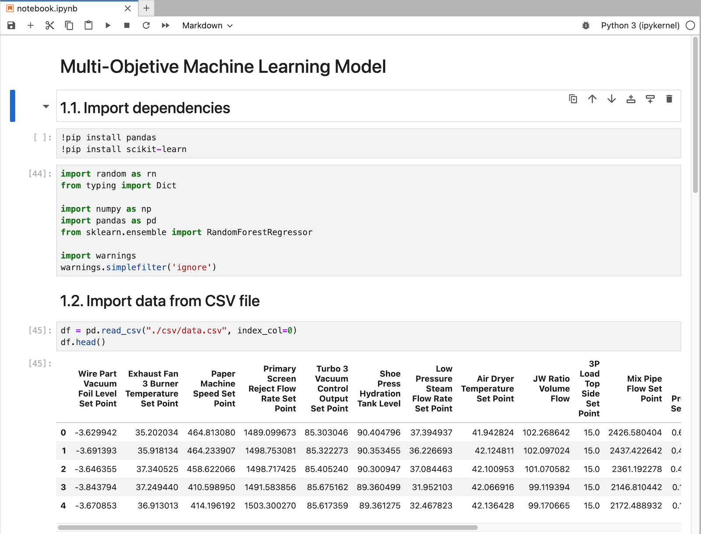

# Multi-Objective Optimization with Machine Learning
This application demonstrates the use of the Kelvin SDK for multi-objective optimization with machine learning.

It keeps a rolling window of each asset's data (the SDK's count-based `app.rolling_window`, which rounds same-second readings into one dense row), fits a scikit-learn random forest regression model for each of the four desired outputs, and treats those four models as objective functions. A genetic algorithm (NSGA-II) then searches for the Pareto front, and the selected input set points are published as control changes inside a `Recommendation` for the operator to accept or reject.

**Desired outputs:**
- paper_substance_weight
- paper_brightness_top_side
- luminance_value_top_side
- luminance_value_bottom_side

**Inputs:**
- wire_part_vacuum_foil_level_set_point
- exhaust_fan_3_burner_temperature_set_point
- paper_machine_speed_set_point
- primary_screen_reject_flow_rate_set_point
- turbo_3_vacuum_control_output_set_point
- shoe_press_hydration_tank_level
- low_pressure_steam_flow_rate_set_point
- air_dryer_temperature_set_point
- jw_ratio_volume_flow
- 3p_load_top_side_set_point
- mix_pipe_flow_set_point
- top_dryers_steam_pressure_set_point
- spray_starch_standby_pump_rate_set_point

## How It Works
- An `@app.task` rolls a per-asset window over the 17 streams with `app.rolling_window(round_to=timedelta(seconds=1))`, which merges same-second readings into dense rows and yields the columns in `INPUTS` order (the 13 controllable inputs first, then the 4 measured targets, the order `run_model` splits on).
- `run_model` (`multi_objective_optimization.py`) fits the regression models and runs NSGA-II once the window holds enough aligned rows (100 rows across the 17 streams); with less data it returns nothing and no recommendation is published.
- The recommended set points are filtered to the controllable inputs and published as one `Recommendation` carrying a `ControlChange` per set point, so an operator reviews the full change set together.

## Configuration
Window behavior is app configuration (`app.app_configuration`, validated by `settings.Window`). Set it on the deployment, or in a local `config.yaml` next to `main.py`:

```yaml
window:
  rows: 100                 # rows of history the models fit on (must be >= 100; the model needs it to train)
  retrain_every_rows: 1     # re-run the optimizer every N new rows (raise it to retrain less often)
  round_seconds: 1          # merge readings within this interval into one row
```

`rows` and `retrain_every_rows` map to the SDK window's `count_size` and `slide` in message terms (`rows * 17` and `retrain_every_rows * 17`), and `round_seconds` maps to `round_to`. The window is built when the app starts, so changing these requires a redeploy.

## Jupyter Notebook
`jupyter/notebook.ipynb` walks through the algorithm on its own.



## Prerequisites
1. Python 3.13 (the version the app is built and tested on; see the `Dockerfile`).
2. Install the Kelvin CLI (needed for `kelvin app upload`): `pip3 install kelvin-sdk`.
3. Install project dependencies: `pip3 install -r requirements.txt`.
4. Docker (optional) to upload the application to Kelvin Cloud.

## Run Locally
1. **Run** the application: `python3 main.py`
2. Open a new terminal and replay the bundled dataset (it carries enough rows for the model to fire):
    ```
    kelvin app test csv --csv csv/data.csv --asset-count 1 --publish-rate 0 --offset-timestamps
    ```

## Test Locally
### Unit Tests
```bash
pip install 'kelvin-python-sdk[testing]'        # harness deps
pytest                                           # fast, no Docker
```
- **Unit** (`tests/test_main.py`): the window and handler via `KelvinAppTest` with `run_model` stubbed, covering the model-ordered columns and controllable-only control changes, no output below the window size, a configured window size changing the trigger, and a model error that doesn't stop the stream; plus `settings.Window` validation (`rows` floored at 100).

## Kelvin Cloud Deployment
1. **Upload** the application (builds and registers the image; needs Docker):
    ```
    kelvin app upload
    ```
2. **Deploy** it and map the input streams and set-point control changes to each asset. This app needs no secrets.
