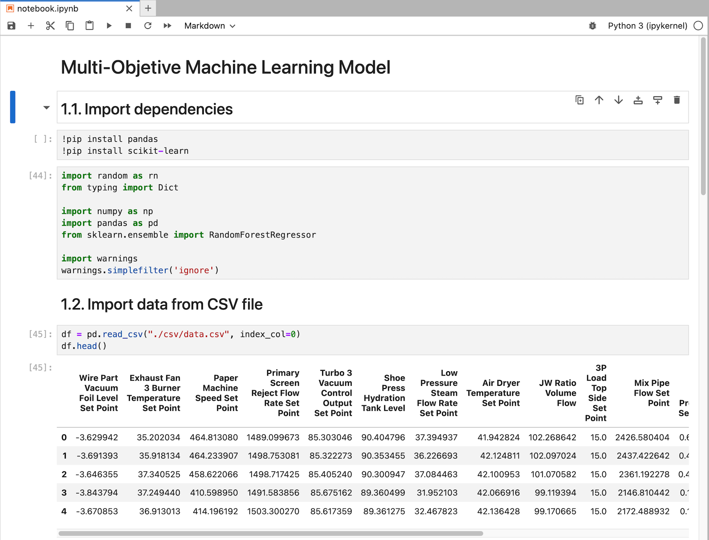

# Multi-Objective Optimization with Machine Learning
This application demonstrates the usage of the Kelvin SDK to implement a multi-objective optimization problem using machine learning. 

The code dynamically processes incoming data streams and appends the data points to rolling window represented by a Pandas DataFrame for each asset. The window can be configured to have a fixed size (number of data points) or a fixed time window. 

It leverages the scikit-learn library to fit a random forest regression model to the window of data. There are 4 desired outputs and 4 regression models are fit to map the inputs on each of the outputs. Therefore we will end up with 4 objective functions, one per output. Here are the desired outputs and the inputs that are used to fit the regression models:

**Desired Outputs:**
- paper_substance_weight
- paper_brightness_top_side
- luminance_value_top_side
- luminance_value_bottom_side

**Inputs:**
- wire_part_vacuum_foil_level_set_point
- exhaust_fan_3_burner_temperature_set_point
- paper_machine_speed_set_point
- primary_screen_reject_flow_rate_set_point
- turbo_3_vacuum_control_output_set_point
- shoe_press_hydration_tank_level
- low_pressure_steam_flow_rate_set_point
- air_dryer_temperature_set_point
- jw_ratio_volume_flow
- 3p_load_top_side_set_point
- mix_pipe_flow_set_point
- top_dryers_steam_pressure_set_point
- spray_starch_standby_pump_rate_set_point

After obtaining the objective functions, we implemented a genetic algorithm (Non-dominated Sorting Genetic Algorithm, (NSGA II)) to find the pareto front.

The Pareto front comprises a collection of input variables, identified and suggested by the algorithm. This collection is packaged as a list of Control Changes that are Recommended to the operator. The operator can then choose to accept or reject the recommended changes.

# Jupyter Notebook
A Jupyter notebook `jupyter/notebook.ipynb` is provided to demonstrate the usage of the algorithm.

# Requirements
1. Python 3.8 or higher
2. Install Kelvin SDK: `pip3 install kelvin-sdk`
3. Install project dependencies: `pip3 install -r requirements.txt`
4. Docker (optional) for upload the application to a Kelvin Instance.

# Usage
1. Run the application: `python3 main.py`
2. Open a new terminal and test with the provided CSV file: `kelvin app test csv --csv csv/data.csv --asset-count 1 --publish-rate 0 --offset-timestamps`

https://github.com/kelvininc/app-samples/assets/5788338/eb8b6a6d-1f45-4d98-a0a7-70fac7934931
