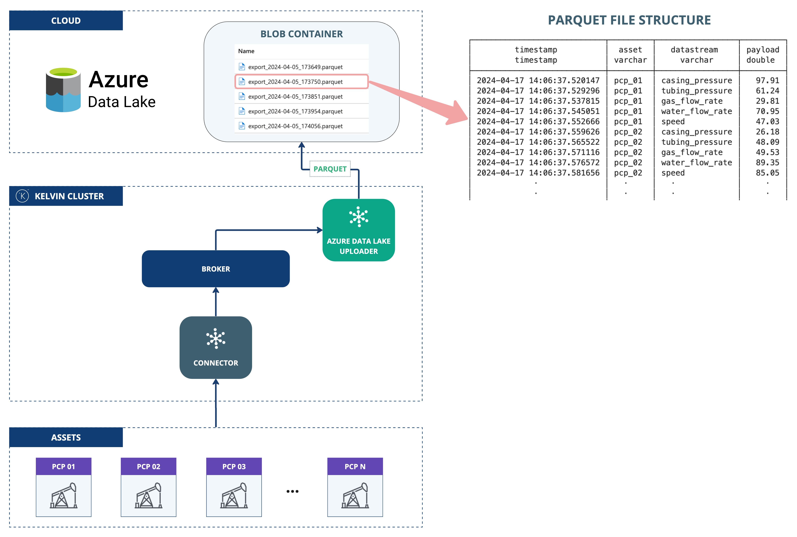

# Azure Data Lake Uploader
This application demonstrates the use of the Kelvin SDK for uploading streaming data to Azure Data Lake Storage Gen2.

The streaming data is first batched, then exported as either a CSV or Parquet file, and subsequently uploaded to Azure Data Lake Storage Gen2.

# Architecture Diagram
The following diagram illustrates the architecture of the solution:



# Requirements
1. Python 3.8 or higher
2. Install Kelvin SDK: `pip3 install kelvin-sdk`
3. Install project dependencies: `pip3 install -r requirements.txt`
4. Docker (optional) for upload the application to a Kelvin Instance.

# Usage
1. Export Azure Credentials as environment variables:
```
export AZURE_ACCOUNT_NAME='...'
export AZURE_ACCOUNT_KEY="..."
export AZURE_STORAGE_CONTAINER='...'
```
2. Open a new terminal and **Run** the application: `python3 main.py`
3. Open a new terminal and **Test** with synthetic data: `kelvin app test simulator`

# Secrets
To deploy this application in a Kelvin Cluster you need to create the following secrets:

```
kelvin secret create azure-account-name --value <name>
kelvin secret create azure-account-key --value <key>
kelvin secret create azure-storage-container --value <container>
```