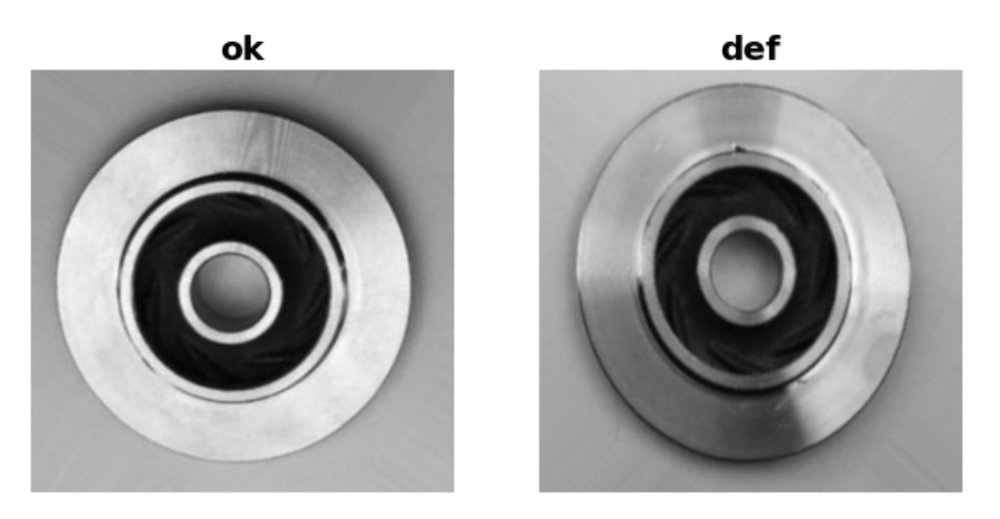
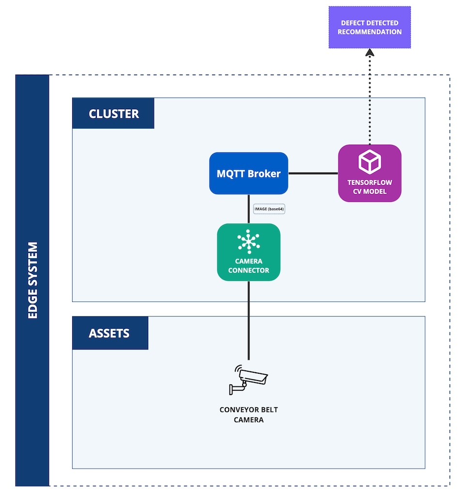

# Casting Defect Detection using Computer Vision
This application demonstrates the usage of the Kelvin SDK to implement a solution to detect manufacturing defects using computer vision and machine learning. 

The solution consists of two main components:

1. **Camera Connector:** Simulates image capture from a camera and publishes the image in base64 format to the Kelvin Platform. In production environments, it would interface directly with live camera feeds to acquire real-time images.

2. **Casting Defect Detection:** Processes the acquired images to identify casting defects using a pre-trained TensorFlow machine learning model. It evaluates the images for any anomalies and reports the findings back to the Kelvin Platform for further analysis.

# Architecture Diagram
The following diagram illustrates the architecture of the solution:

## Additional Resources

- **Dataset:** The dataset employed for training the model is hosted on Kaggle and can be accessed [here](https://www.kaggle.com/datasets/ravirajsinh45/real-life-industrial-dataset-of-casting-product/data).

- **Pre-trained Model:** The Tensorflow machine learning model used for defect detection is also available on Kaggle. It can be found [here](https://www.kaggle.com/code/ravirajsinh45/simple-model-for-casting-product-classification/notebook).

# Requirements
1. Python 3.8 or higher
2. Install Kelvin SDK: `pip3 install kelvin-sdk`
3. Install project dependencies: `pip3 install -r requirements.txt`
4. Docker (optional) for upload the application to a Kelvin Instance.

# Usage
1. Upload both applications to a Kelvin Instance: `kelvin app upload`
2. Deploy the Camera Connector application
3. Deploy the Casting Defect Detection application