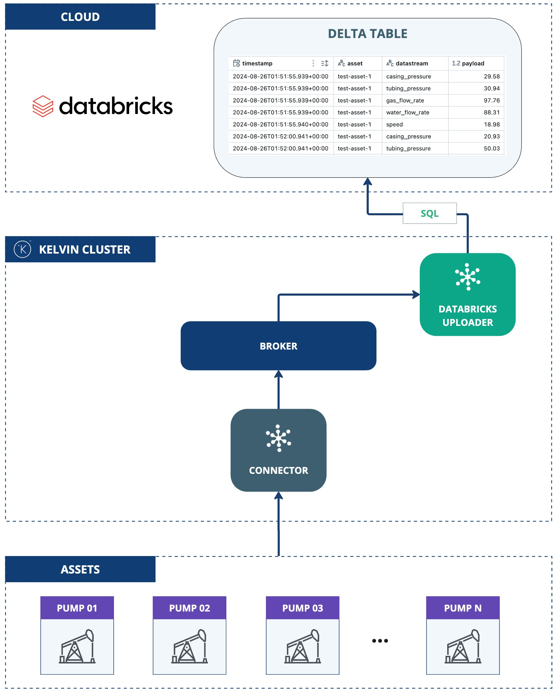

# Databricks Delta Table Uploader
This application demonstrates the use of the Kelvin SDK for uploading streaming data to a Databricks Delta Table.

The streaming data is first batched, then exported as a Pandas Dataframe, and subsequently inserted into the table.

# Architecture Diagram
The following diagram illustrates the architecture of the solution:



# Databricks Setup Requirements

To run this application, you need to properly configure your Databricks workspace. The steps below guide you through creating the necessary resources. We recommend using a Databricks Serverless Warehouse to set up your workspace efficiently.

## 1. Create Delta Table

Create a Delta Table with the following command:

```sql
CREATE TABLE IF NOT EXISTS <catalog>.<schema>.<table> (
    timestamp TIMESTAMP_NTZ,
    asset STRING,
    datastream STRING,
    payload DOUBLE
)
USING DELTA;
```

## 2. Grant Permissions

You need to grant the necessary permissions for the application to access the Delta Table:

```sql
GRANT USE CATALOG ON CATALOG <catalog_name> TO `user1`;
GRANT USE SCHEMA ON SCHEMA <catalog_name>.<schema_name> TO `user1`;

GRANT SELECT ON TABLE <catalog_name>.<schema_name>.<table_name> TO `user1`;
GRANT MODIFY ON TABLE <catalog_name>.<schema_name>.<table_name> TO `user1`;
```

# Requirements
1. Python 3.9 or higher
2. Install Kelvin SDK: `pip3 install kelvin-sdk`
3. Install project dependencies: `pip3 install -r requirements.txt`
4. Docker (optional) for upload the application to Kelvin Cloud.

# Local Usage
1. Define Databricks environment variables:
    ```
    export DATABRICKS_SERVER_HOSTNAME="..."
    export DATABRICKS_HTTP_PATH="..."
    export DATABRICKS_DELTA_TABLE="<catalog>.<schema>.<table>"
    ```

2. Define Databricks Authentication environment variables:

    - If using **OAuth machine-to-machine (M2M)**:
        ```
        export DATABRICKS_CLIENT_ID="..."
        export DATABRICKS_CLIENT_SECRET="..."
        ```

    - If using **Databricks Personal Access Token (PAT)**:
        ```
        export DATABRICKS_ACCESS_TOKEN="..."
        ```

3. **Run** the application: `python3 main.py`
4. Open a new terminal and **Test** with synthetic data: `kelvin app test simulator`

# Kelvin Cloud Deployment
To deploy this application to a cluster using the Kelvin Cloud you need to setup the environment variables as Secrets.

```
kelvin secret create databricks-server-hostname --value "<server-hostname>"
kelvin secret create databricks-http-path --value "<http-path>"
kelvin secret create databricks-delta-table --value "<catalog>.<schema>.<table>"
```

- If using **OAuth machine-to-machine (M2M)**:
    ```
    kelvin secret create databricks-client-id --value "<client-id>"
    kelvin secret create databricks-client-secret --value "<client-secret>"
    ```

- If using **Databricks Personal Access Token (PAT)**:
    ```
    kelvin secret create databricks-access-token --value "<token>"
    ```
