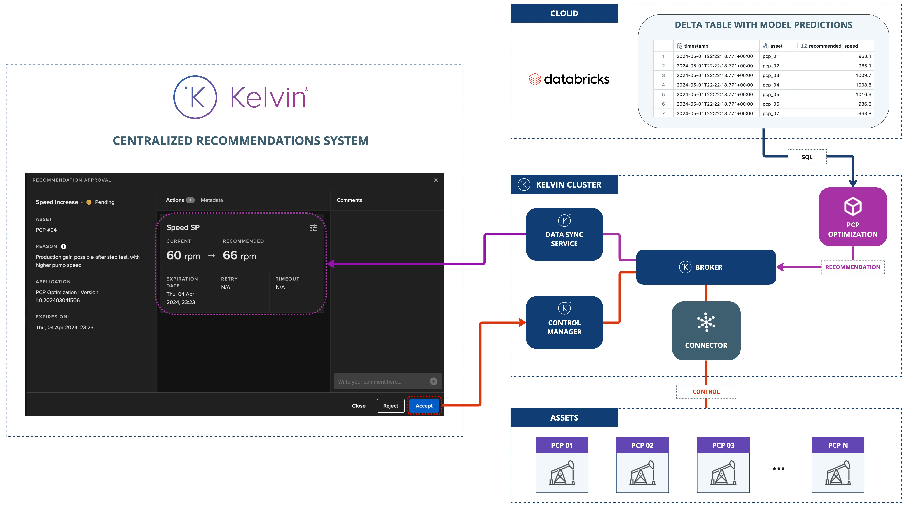
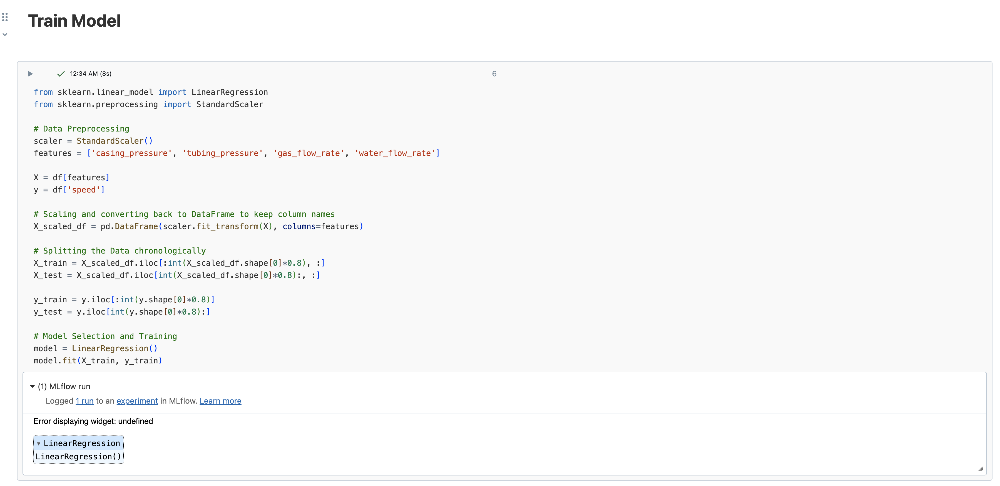

# Databricks Delta Table
This application demonstrates the use of the Kelvin SDK to query predictions stored in a Databricks Delta Table from a machine learning model.

It periodically retrieves these predictions and generates Kelvin Recommendations based on them.

# Architecture Diagram
The following diagram illustrates the architecture of the solution:



# Jupyter Notebook
A Jupyter notebook `jupyter/notebook.ipynb` is provided to demonstrate the usage of the model. This notebook should be run in a Databricks environment.



# Requirements
1. Python 3.8 or higher
2. Install Kelvin SDK: `pip3 install kelvin-sdk`
3. Install project dependencies: `pip3 install -r requirements.txt`
4. Docker (optional) for upload the application to a Kelvin Instance.

# Usage
1. Export Databricks Credentials as environment variables:
```
export DATABRICKS_SERVER_HOSTNAME='...'
export DATABRICKS_HTTP_PATH="..."
export DATABRICKS_ACCESS_TOKEN='...'
```
2. Open a new terminal and **Test** with synthetic data: `kelvin app test simulator`
3. Open a new terminal and **Run** the application: `python3 main.py`
4. Run the Jupyter notebook in a Databricks environment to populate the Delta Table with model predictions.

# Secrets
To deploy this application in a Kelvin Cluster you need to create the following secrets:

```
kelvin secret create databricks-server-hostname --value <name>
kelvin secret create databricks-http-path --value <key>
kelvin secret create databricks-access-token --value <container>
```