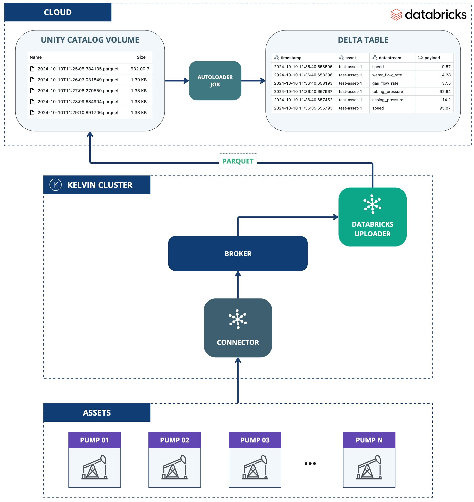

# Databricks Volume Uploader
This application demonstrates the use of the Kelvin SDK for uploading streaming data to a Databricks Volume.

The streaming data is first batched, then exported as parquet file, and subsequently uploaded into a Databricks Volume. 

# Architecture Diagram
The following diagram illustrates the architecture of the solution:



# Databricks Setup Requirements

To run this application, you need to properly configure your Databricks workspace. The steps below guide you through creating the necessary resources. We recommend using a Databricks Serverless Warehouse to set up your workspace efficiently.

## 1. Create Unity Catalog Volume

To begin, create a new volume using the following command:

```sql
CREATE VOLUME <catalog>.<schema>.<volume>;
```

## 2. Create Delta Table

Next, create a Delta Table with the following command:

```sql
CREATE TABLE IF NOT EXISTS <catalog>.<schema>.<table> (
    timestamp TIMESTAMP_NTZ,
    asset STRING,
    datastream STRING,
    payload DOUBLE
)
USING DELTA;
```

## 3. Grant Permissions

You need to grant the necessary permissions for the application to access the Volume and Delta Table:

```sql
GRANT USE CATALOG ON CATALOG <catalog_name> TO `<service principal id>`;
GRANT USE SCHEMA ON SCHEMA <catalog_name>.<schema_name> TO `<service principal id>`;

GRANT READ VOLUME ON VOLUME <catalog_name>.<schema_name>.<volume_name> TO `<service principal id>`;
GRANT WRITE VOLUME ON VOLUME <catalog_name>.<schema_name>.<volume_name> TO `<service principal id>`;
```

If you plan to use a data ingestion job, grant these additional permissions:

```sql
GRANT SELECT ON TABLE <catalog_name>.<schema_name>.<table_name> TO `<service principal id>`;
GRANT MODIFY ON TABLE <catalog_name>.<schema_name>.<table_name> TO `<service principal id>`;
```

## 4. Configure Data Ingestion

The application can set up a Databricks job to continuously ingest data into the Delta Table. You have two options for ingestion job:

- **Auto Loader** (Recommended)
- **COPY INTO**

### Option 1: Auto Loader (Recommended)

If you set the `DATABRICKS_JOB_CLUSTER_ID` environment variable, the application will create an Auto Loader job. This job is triggered automatically when new files arrive in the volume. Below is a PySpark code snippet demonstrating how Auto Loader works:

```python
from pyspark.sql.types import StructType, StructField, StringType, TimestampNTZType, DoubleType

# Define schema for incoming data
schema = StructType([
    StructField("timestamp", TimestampNTZType(), True),
    StructField("asset", StringType(), True),
    StructField("datastream", StringType(), True),
    StructField("payload", DoubleType(), True),
])

# Start the streaming query
(spark.readStream
  .schema(schema)
  .format("cloudFiles")
  .option("cloudFiles.format", "parquet")
  .load('/Volumes/<catalog>/<schema>/<volume>/data/')
  .writeStream
  .option("checkpointLocation", '/Volumes/<catalog>/<schema>/<volume>/checkpoints')
  .trigger(availableNow=True)
  .toTable('<catalog>.<schema>.<table>')
)
```

### Option 2: COPY INTO

If you set the `DATABRICKS_JOB_WAREHOUSE_ID` environment variable, the application will create a job that runs the following SQL task:

```sql
COPY INTO <catalog>.<schema>.<table>
FROM '/Volumes/<catalog>/<schema>/<volume>'
FILEFORMAT = PARQUET;
```

This job is automatically triggered when new files are added to the volume.

# Requirements
1. Python 3.9 or higher
2. Install Kelvin SDK: `pip3 install kelvin-sdk`
3. Install project dependencies: `pip3 install -r requirements.txt`
4. Docker (optional) for upload the application to Kelvin Cloud.

# Local Usage
1. Define Databricks environment variables:
    ```
    export DATABRICKS_SERVER_HOSTNAME="..."
    export DATABRICKS_DELTA_TABLE="<catalog>.<schema>.<table>"
    export DATABRICKS_UC_VOLUME="<catalog>.<schema>.<volume>"
    ```

2. Define Databricks Job environment variables:

    - If using **Auto Loader** (Recommended):
        ```
        export DATABRICKS_JOB_CLUSTER_ID="..."
        ```
    
    - If using **COPY INTO**:
        ```
        export DATABRICKS_JOB_WAREHOUSE_ID="..."
        ```

3. Define Databricks Authentication environment variables:

    - If using **OAuth machine-to-machine (M2M)** (Recommended):
        ```
        export DATABRICKS_CLIENT_ID="..."
        export DATABRICKS_CLIENT_SECRET="..."
        ```

    - If using **Databricks Personal Access Token (PAT)**:
        ```
        export DATABRICKS_ACCESS_TOKEN="..."
        ```

4. **Run** the application: `python3 main.py`
5. Open a new terminal and **Test** with synthetic data: `kelvin app test simulator`

# Kelvin Cloud Deployment
To deploy this application to a cluster using the Kelvin Cloud you need to setup the environment variables as Secrets.

```
kelvin secret create databricks-server-hostname --value "<server-hostname>"
kelvin secret create databricks-delta-table --value "<catalog>.<schema>.<table>"
kelvin secret create databricks-uc-volume --value "<catalog>.<schema>.<volume>"
```

- If using **Auto Loader** (Recommended):
    ```
    kelvin secret create databricks-job-cluster-id --value "<cluster-id>"
    ```

- If using **COPY INTO**:
    ```
    kelvin secret create databricks-job-warehouse-id --value "<warehouse-id>"
    ```

- If using **OAuth machine-to-machine (M2M)** (Recommended):
    ```
    kelvin secret create databricks-client-id --value "<client-id>"
    kelvin secret create databricks-client-secret --value "<client-secret>"
    ```

- If using **Databricks Personal Access Token (PAT)**:
    ```
    kelvin secret create databricks-access-token --value "<token>"
    ```