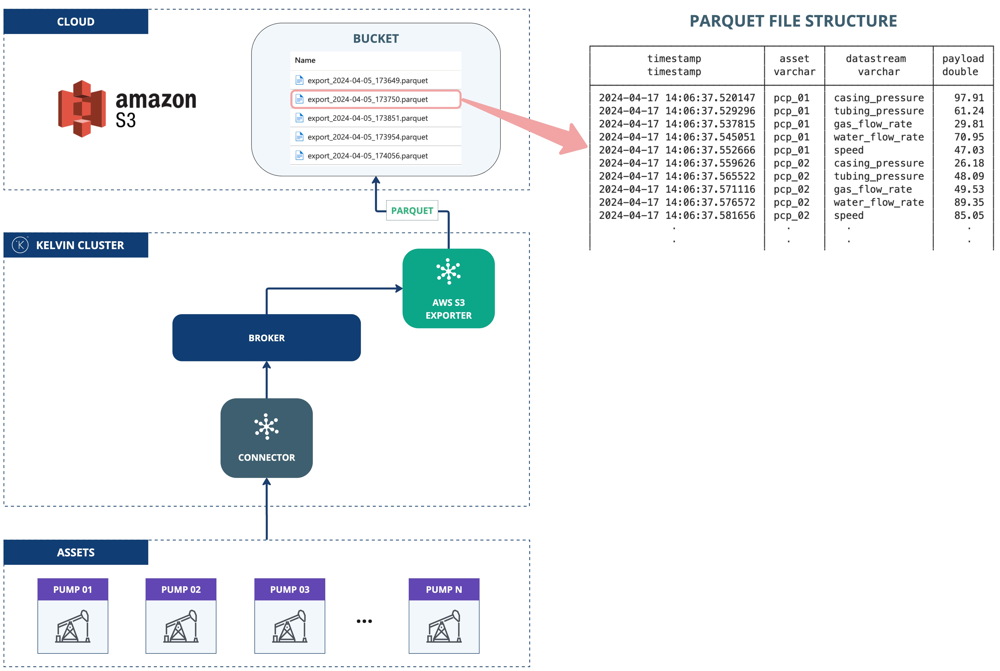

# AWS S3 Uploader
This application demonstrates the use of the Kelvin SDK for uploading streaming data to AWS S3.

The streaming data is first batched, then exported as either a CSV or Parquet file, and subsequently uploaded to an AWS S3 bucket.

# Architecture Diagram
The following diagram illustrates the architecture of the solution:



# Requirements
1. Python 3.9 or higher
2. Install Kelvin SDK: `pip3 install kelvin-sdk`
3. Install project dependencies: `pip3 install -r requirements.txt`
4. Docker (optional) for upload the application to a Kelvin Instance.

# Usage
1. Export AWS Credentials as environment variables:
    ```
    export AWS_ACCESS_KEY_ID="..."
    export AWS_SECRET_ACCESS_KEY="..."
    export AWS_S3_BUCKET="..."
    export AWS_REGION="..."
    ```

2. **Run** the application: `python3 main.py`
3. Open a new terminal and **Test** with synthetic data: `kelvin app test simulator`

# Kelvin Cloud Deployment
To deploy this application to a cluster using the Kelvin Cloud you need to setup the environment variables as Secrets.

```
kelvin secret create aws-access-key-id --value "<access_key>"
kelvin secret create aws-secret-access-key --value "<secret_key>"
kelvin secret create aws-s3-bucket --value "<bucket>"
kelvin secret create aws-region --value "<region>"
```