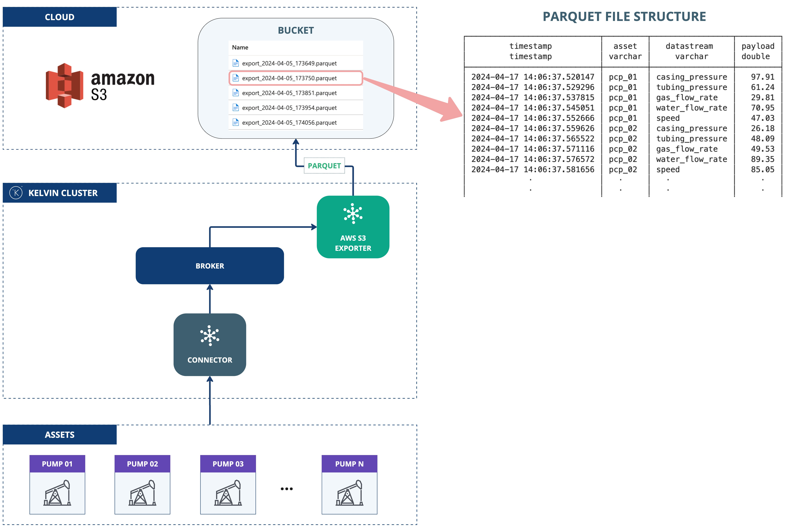

# AWS S3 Exporter
This application demonstrates the use of the Kelvin SDK for uploading streaming data to AWS S3.

Incoming streaming data is buffered in a local DuckDB file, then drained in batches, streamed to a Parquet/CSV/JSON file, and uploaded to an S3 bucket. Number, string, and boolean values keep their native types through a type-preserving scalar-JSON payload column.

## Architecture Diagram



## Delivery Semantics
Delivery is **at-least-once**. Objects are keyed `batch-<utc-timestamp>-<cursor>.<fmt>` with the
timestamp taken at upload time, so keys never collide across deployments; a
retried upload (upload succeeded, but the app crashed before trimming the buffer) writes the same
batch under a second name. Consumers must tolerate duplicates; deduplicate on
`timestamp` + `asset` + `datastream` if exact-once matters downstream.

Within the buffer, records sharing the same (`timestamp`, `asset`, `datastream`) are deduplicated last-write-wins before export, so a corrected value for an already-buffered key replaces the earlier one rather than exporting both.

## Prerequisites
1. Python 3.13 (the version the app is built and tested on; see the `Dockerfile`).
2. Install the Kelvin CLI (needed for `kelvin app upload`): `pip3 install kelvin-sdk`.
3. Install project dependencies: `pip3 install -r requirements.txt`.
4. Docker (optional) to upload the application to Kelvin Cloud.

## Run Locally
Configuration is read from `app.app_configuration`, the same nested structure the
platform injects on deployment. For local runs, put a `config.yaml` in the app root
(next to `main.py`); the SDK reads it and passes it through as `app_configuration`.
There are no `AWS_*` environment variables; everything lives under the `s3`, `upload`,
and `buffer` blocks.

1. Create `config.yaml` in the app root:
    ```yaml
    s3:
      region: "<region>"
      bucket: "<bucket>"
      prefix: ""                       # optional folder within the bucket
      auth:
        # Omit auth entirely to use the AWS default credential chain (IAM role), or:
        access_key_id: "<access-key-id>"
        secret_access_key: "<secret-access-key>"
    upload:
      interval: 60
      batch_size: 1000
      format: parquet                  # "parquet" | "csv" | "json"
    ```

2. **Run** the application: `python3 main.py`
3. Open a new terminal and **Test** with synthetic data: `kelvin app test simulator`

## Test Locally
Two layers, gated so the default run needs no Docker.

### Unit Tests
```bash
pip install 'kelvin-python-sdk[testing]'        # harness deps
pytest                                           # unit tests (fast, no Docker)
```

`test_*.py` covers store/drain/writer logic and settings validation (no network).

### Integration Tests
```bash
pip install 'testcontainers[minio]'              # real-server deps
pytest -m integration                            # smoke test against a live MinIO server (Docker required)
```

`test_integration.py` is marker-gated and deselected by default. It boots a MinIO
(S3-compatible) container and drives the real `S3Writer`: uploads a batch via boto3 and verifies the
object landed in the bucket. The test points the writer's boto3 client at MinIO (path-style
addressing); the connector code is unchanged. Docker is required.

## Kelvin Cloud Deployment
1. **Upload** the application (builds and registers the image; needs Docker):
    ```
    kelvin app upload
    ```
2. **Deploy** it: On a cluster, the same `s3` / `upload` / `buffer` configuration is set on the deployment
rather than in a local `config.yaml`. The access keys must be **Secrets**; the
non-sensitive fields (`region`, `bucket`, `prefix`) can be set directly. You can also
omit the keys entirely and rely on the cluster's IAM role (AWS default credential chain).

    1. Create the credential secrets (skip if using an IAM role):
        ```
        kelvin secret create aws-access-key-id --value "<access-key-id>"
        kelvin secret create aws-secret-access-key --value "<secret-access-key>"
        ```

    2. Reference the secrets from the deployment configuration with `<% secrets.<name> %>`,
       and set the non-sensitive fields directly:

        ```yaml
        s3:
          region: "<region>"
          bucket: "<bucket>"
          auth:
            access_key_id: "<% secrets.aws-access-key-id %>"
            secret_access_key: "<% secrets.aws-secret-access-key %>"
        ```

    > Wire credentials only via `<% secrets... %>`; leave them out of `app.yaml` defaults so a
    > baked-in placeholder can't be mistaken for a real credential.
