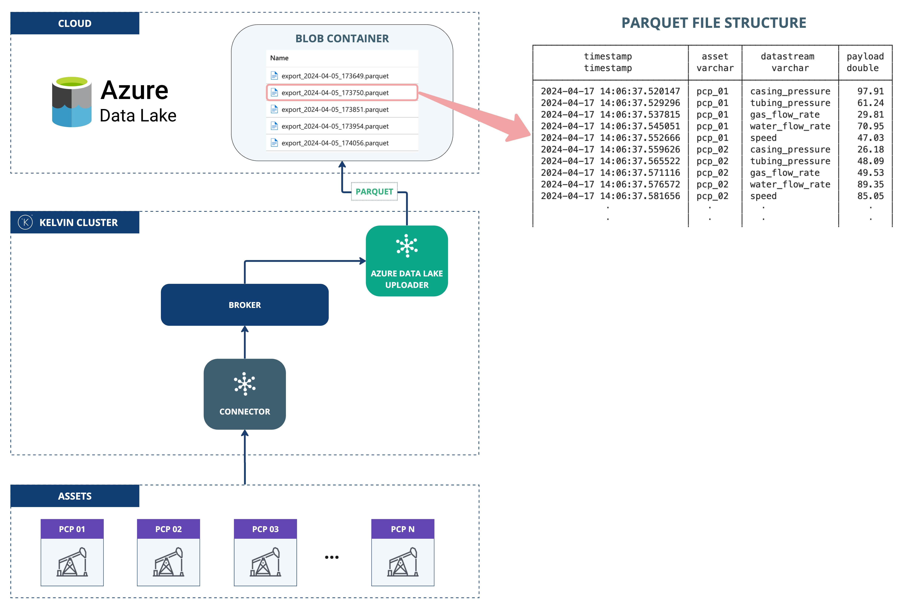

# Azure Data Lake Exporter
This application demonstrates the use of the Kelvin SDK for uploading streaming data to Azure Data Lake Storage (ADLS Gen2).

Incoming streaming data is buffered in a local DuckDB file, then drained in batches, streamed to a Parquet/CSV/JSON file, and uploaded to an ADLS container. Number, string, and boolean values keep their native types through a type-preserving scalar-JSON payload column.

## Architecture Diagram



## Delivery Semantics
Delivery is **at-least-once**: the buffer is trimmed only after a confirmed upload. Blobs are
named `batch-<utc-timestamp>-<cursor>.<format>` with the timestamp generated at upload time, so
a retried upload (for example after a crash between the upload and the buffer trim) can write
the same batch under two different names. Consumers must tolerate duplicate rows.

Within the buffer, rows are keyed by `(timestamp, asset, datastream)`: a second value for the
same key overwrites the first (last-write-wins), so a correction sent for an already-buffered
sample replaces it rather than uploading twice.

## Prerequisites
1. Python 3.13 (the version the app is built and tested on; see the `Dockerfile`).
2. Install the Kelvin CLI (needed for `kelvin app upload`): `pip3 install kelvin-sdk`.
3. Install project dependencies: `pip3 install -r requirements.txt`.
4. Docker (optional) to upload the application to Kelvin Cloud.

## Run Locally
Configuration is read from `app.app_configuration`, the same nested structure the
platform injects on deployment. For local runs, put a `config.yaml` in the app root
(next to `main.py`); the SDK reads it and passes it through as `app_configuration`.
There are no `AZURE_*` environment variables; everything lives under the `adls`,
`upload`, and `buffer` blocks.

1. Create `config.yaml` in the app root:
    ```yaml
    adls:
      account_name: "<storage-account-name>"
      container: "<container>"
      auth:
        # Omit auth entirely to use the cluster's managed identity (DefaultAzureCredential), or:
        account_key: "<account-key>"
    upload:
      interval: 60
      batch_size: 1000
      format: parquet                  # "parquet" | "csv" | "json"
    ```

2. **Run** the application: `python3 main.py`
3. Open a new terminal and **Test** with synthetic data: `kelvin app test simulator`

## Test Locally

### Unit Tests

```bash
pip install 'kelvin-python-sdk[testing]'        # harness deps
pytest                                           # unit tests (fast, no Docker)
```

Unit tests (`test_*.py`) cover store/drain/writer logic and settings validation, with the ADLS client faked.

### Integration Tests

There is **no integration test** for this connector, unlike the SFTP/S3/email samples. Azurite (the
only local Azure emulator) does not implement the ADLS Gen2 datalake write path: `create_file_system`
and `get_file_system_properties` work, but `upload_data`, the operation this exporter exists to
perform, fails. A container test would only cover connection setup, not the actual upload, which
would be false confidence. Validate changes against a real ADLS Gen2 account (or a staging container)
instead.

## Kelvin Cloud Deployment
1. **Upload** the application (builds and registers the image; needs Docker):
    ```
    kelvin app upload
    ```
2. **Deploy** it: On a cluster, the same `adls` / `upload` / `buffer` configuration is set on the deployment
rather than in a local `config.yaml`. The account key must be a **Secret**; the
non-sensitive fields (`account_name`, `container`) can be set directly. You can also omit
the key entirely and grant the cluster's managed identity RBAC on the container; the app
then authenticates secretless via `DefaultAzureCredential` (the Azure analog of an IAM role).

    1. Create the credential secret (skip if using managed identity):
        ```
        kelvin secret create azure-account-key --value "<account-key>"
        ```

    2. Reference the secret from the deployment configuration with `<% secrets.<name> %>`,
       and set the non-sensitive fields directly:

        ```yaml
        adls:
          account_name: "<storage-account-name>"
          container: "<container>"
          auth:
            account_key: "<% secrets.azure-account-key %>"
        ```

    > Wire the account key only via `<% secrets... %>`; leave it out of `app.yaml` defaults so a
    > baked-in placeholder can't be mistaken for a real credential.
