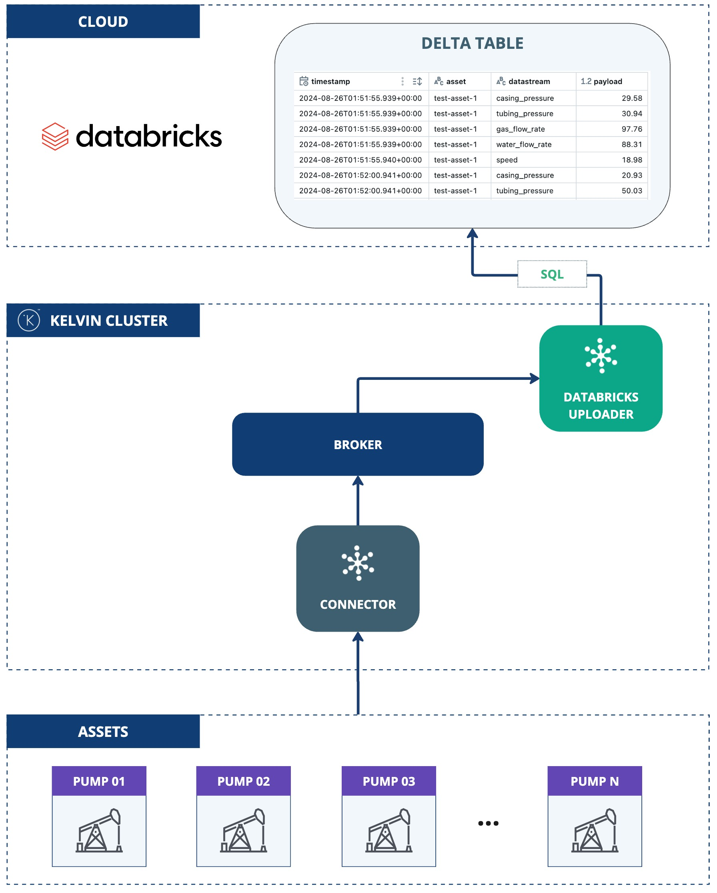

# Databricks Delta Table Exporter
This application demonstrates the use of the Kelvin SDK for uploading streaming data to a Databricks Delta Table.

Incoming streaming data is buffered in a local DuckDB file, then drained in batches and written to the table with a single `INSERT ... parse_json(?)` statement per batch, using connector-escaped parameters. Number, string, and boolean values keep their native types through a `VARIANT` payload column.

## Architecture Diagram



## Delivery Semantics
Delivery is **at-least-once**: the buffer is trimmed only after the batch `INSERT` commits. If the app crashes after the insert commits but before the buffer trim, the same batch is inserted again on restart, producing duplicate rows in the Delta table. Consumers must tolerate or deduplicate duplicates (for example on `timestamp` + `asset` + `datastream`).

While a batch is still buffered, a second value with the same `timestamp` + `asset` + `datastream` overwrites the first: the buffer keys on that triple and applies last-write-wins, so a corrected reading replaces the stale one before it's uploaded. Distinct timestamps are always kept as separate rows.

## Databricks Setup

Set up the following Databricks resources first. A Serverless Warehouse is the simplest option.

### 1. Create Delta Table

Create the target table:

```sql
CREATE TABLE IF NOT EXISTS <catalog>.<schema>.<table> (
    timestamp TIMESTAMP_NTZ,
    asset STRING,
    datastream STRING,
    payload VARIANT
)
USING DELTA;
```

> `payload` is a `VARIANT` so the table holds number, string, and boolean stream values with
> their types preserved. The app inserts each value with `parse_json(?)`. Requires Databricks
> Runtime 15.4 LTS or later (or Serverless SQL). On older runtimes use `payload STRING`
> instead; the exporter writes the same scalar-JSON value either way.
>
> Query typed values back with `payload::double`, `payload::string`, `payload::boolean`, and
> inspect the stored type with `schema_of_variant(payload)`.

### 2. Grant Permissions

Grant the app access to the table:

```sql
GRANT USE CATALOG ON CATALOG <catalog_name> TO `user1`;
GRANT USE SCHEMA ON SCHEMA <catalog_name>.<schema_name> TO `user1`;

GRANT SELECT ON TABLE <catalog_name>.<schema_name>.<table_name> TO `user1`;
GRANT MODIFY ON TABLE <catalog_name>.<schema_name>.<table_name> TO `user1`;
```

## Prerequisites
1. Python 3.13 (the version the app is built and tested on; see the `Dockerfile`).
2. Install the Kelvin CLI (needed for `kelvin app upload`): `pip3 install kelvin-sdk`.
3. Install project dependencies: `pip3 install -r requirements.txt`.
4. Docker (optional) to upload the application to Kelvin Cloud.

## Run Locally
Configuration is read from `app.app_configuration`, the same nested structure the
platform injects on deployment. For local runs, put a `config.yaml` in the app root
(next to `main.py`); the SDK reads it and passes it through as `app_configuration`.
There are no `DATABRICKS_*` environment variables; everything lives under the
`databricks`, `upload`, and `buffer` blocks.

1. Create `config.yaml` in the app root:
    ```yaml
    databricks:
      server_hostname: "<server-hostname>"
      http_path: "<http-path>"
      delta_table: "<catalog>.<schema>.<table>"
      auth:
        # OAuth machine-to-machine (M2M):
        method: oauth
        client_id: "<client-id>"
        client_secret: "<client-secret>"
        # or a Personal Access Token (PAT):
        # method: access_token
        # access_token: "<token>"
    upload:
      interval: 60
      batch_size: 1000
    ```

2. **Run** the application: `python3 main.py`
3. Open a new terminal and **Test** with synthetic data: `kelvin app test simulator`

## Test Locally

### Unit Tests

```bash
pip install 'kelvin-python-sdk[testing]'
pytest
```

Store/drain/writer logic and settings validation, with the Databricks client faked (no network).

## Kelvin Cloud Deployment
1. **Upload** the application (builds and registers the image; needs Docker):
    ```
    kelvin app upload
    ```
2. **Deploy** it: On a cluster, the same `databricks` / `upload` / `buffer` configuration is set on the
deployment rather than in a local `config.yaml`. Credentials must be **Secrets**; the
non-sensitive fields (`server_hostname`, `http_path`, `delta_table`) can be set directly
in the deployment configuration or wired to secrets too, whichever you prefer.

    1. Create the credential secrets:

        - **OAuth machine-to-machine (M2M)**:
            ```
            kelvin secret create databricks-client-id --value "<client-id>"
            kelvin secret create databricks-client-secret --value "<client-secret>"
            ```

        - **Databricks Personal Access Token (PAT)**:
            ```
            kelvin secret create databricks-access-token --value "<token>"
            ```

    2. Reference the secrets from the deployment configuration with `<% secrets.<name> %>`,
       and set the non-sensitive fields directly:

        ```yaml
        databricks:
          server_hostname: "<server-hostname>"
          http_path: "<http-path>"
          delta_table: "<catalog>.<schema>.<table>"
          auth:
            method: oauth                                       # or "access_token"
            client_id: "<% secrets.databricks-client-id %>"
            client_secret: "<% secrets.databricks-client-secret %>"
            # access_token: "<% secrets.databricks-access-token %>"
        ```

    > Wire credentials only via `<% secrets... %>`; leave them out of `app.yaml` defaults. A
    > baked-in placeholder is always-truthy and would defeat the "exactly one auth method"
    > validation.
