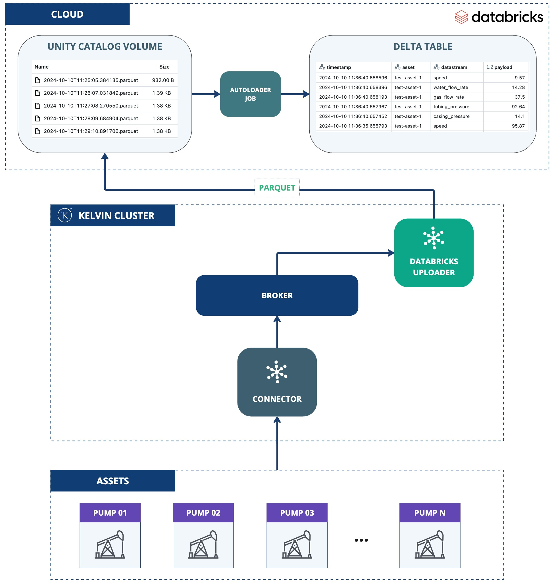

# Databricks Volume Exporter
This application demonstrates the use of the Kelvin SDK for uploading streaming data to a Databricks Unity Catalog Volume.

Incoming streaming data is buffered in a local DuckDB file, then drained in batches, streamed to a Parquet/CSV file, and uploaded to a Databricks Volume. A file-arrival-triggered ingestion job (COPY INTO or Auto Loader) then loads each uploaded file into a Delta table. Number, string, and boolean values keep their native types through a type-preserving scalar-JSON payload column.

## Architecture Diagram



## Delivery Semantics
Delivery is **at-least-once**: the buffer is trimmed only after a confirmed upload. Files are
named `batch-<utc-timestamp>-<cursor>.<format>` with the timestamp generated at upload time, so
a retried upload (for example after a crash between the upload and the buffer trim) can write
the same batch under two different names. The ingestion job then loads both files, producing
duplicate rows in the Delta table. Consumers must tolerate or deduplicate duplicate rows.

## Databricks Setup

Set up the following Databricks resources first. A Serverless Warehouse is the simplest option.

### 1. Create Unity Catalog Volume

```sql
CREATE VOLUME <catalog>.<schema>.<volume>;
```

### 2. Create Delta Table

```sql
CREATE TABLE IF NOT EXISTS <catalog>.<schema>.<table> (
    timestamp TIMESTAMP_NTZ,
    asset STRING,
    datastream STRING,
    payload VARIANT
)
USING DELTA;
```

> `payload` is a `VARIANT` so the table holds number, string, and boolean stream values with
> their types preserved. The exporter writes `payload` into the uploaded files as scalar JSON
> text, and the ingestion job parses it with `parse_json`. Requires Databricks Runtime 15.4 LTS
> or later (or Serverless SQL). On older runtimes use `payload STRING` instead.
>
> Query typed values back with `payload::double`, `payload::string`, `payload::boolean`, and
> inspect the stored type with `schema_of_variant(payload)`.

### 3. Grant Permissions

```sql
GRANT USE CATALOG ON CATALOG <catalog> TO `<service principal id>`;
GRANT USE SCHEMA ON SCHEMA <catalog>.<schema> TO `<service principal id>`;

GRANT READ VOLUME ON VOLUME <catalog>.<schema>.<volume> TO `<service principal id>`;
GRANT WRITE VOLUME ON VOLUME <catalog>.<schema>.<volume> TO `<service principal id>`;
```

If you use a data ingestion job, grant these additional permissions:

```sql
GRANT SELECT ON TABLE <catalog>.<schema>.<table> TO `<service principal id>`;
GRANT MODIFY ON TABLE <catalog>.<schema>.<table> TO `<service principal id>`;
```

### 4. Configure Data Ingestion

On `setup()`, the app can create a file-arrival-triggered Databricks job that ingests each
uploaded file into the Delta table. You have two options:

- **Auto Loader** (Recommended): set `databricks.job.cluster_id` (an existing all-purpose
  cluster). The job streams new files from the volume into the table.
- **COPY INTO**: set `databricks.job.warehouse_id` (a SQL warehouse). The job runs a
  `COPY INTO ... FILEFORMAT = <upload.format>` task. The `FILEFORMAT` matches the exporter's
  configured `upload.format`.

Leave both empty to upload files only and ingest them yourself.

## Prerequisites
1. Python 3.13 (the version the app is built and tested on; see the `Dockerfile`).
2. Install the Kelvin CLI (needed for `kelvin app upload`): `pip3 install kelvin-sdk`.
3. Install project dependencies: `pip3 install -r requirements.txt`.
4. Docker (optional) to upload the application to Kelvin Cloud.

## Run Locally
Configuration is read from `app.app_configuration`, the same nested structure the
platform injects on deployment. For local runs, put a `config.yaml` in the app root
(next to `main.py`); the SDK reads it and passes it through as `app_configuration`.
There are no `DATABRICKS_*` environment variables; everything lives under the `databricks`,
`upload`, and `buffer` blocks.

1. Create `config.yaml` in the app root:
    ```yaml
    databricks:
      server_hostname: "<server-hostname>"
      delta_table: "<catalog>.<schema>.<table>"
      uc_volume: "<catalog>.<schema>.<volume>"
      job:
        # One of these, or neither (upload only):
        cluster_id: "<cluster-id>"          # Auto Loader (recommended)
        # warehouse_id: "<warehouse-id>"    # COPY INTO
      auth:
        method: oauth                        # "oauth" | "access_token"
        # OAuth machine-to-machine (M2M), recommended:
        client_id: "<client-id>"
        client_secret: "<client-secret>"
        # Personal Access Token (PAT) instead:
        # method: access_token
        # access_token: "<token>"
    upload:
      interval: 60
      batch_size: 1000
      format: parquet                        # "parquet" | "csv" (both re-ingest via parse_json)
    buffer:
      max_backlog: 0
    ```

2. **Run** the application: `python3 main.py`
3. Open a new terminal and **Test** with synthetic data: `kelvin app test simulator`

## Test Locally

### Unit Tests
```bash
pip install 'kelvin-python-sdk[testing]'        # harness deps
pytest                                           # unit tests (fast, no Docker)
```

These cover store/drain/writer/job logic and settings validation with the Databricks client
faked (no network).

## Kelvin Cloud Deployment
1. **Upload** the application (builds and registers the image; needs Docker):
    ```
    kelvin app upload
    ```
2. **Deploy** it: On a cluster, the same `databricks` / `upload` / `buffer` configuration is set on the
deployment rather than in a local `config.yaml`. The credentials (`client_id` /
`client_secret`, or `access_token`) must be **Secrets**; the non-sensitive fields
(`server_hostname`, `delta_table`, `uc_volume`, `job.*`) can be set directly.

    1. Create the credential secrets:

        - OAuth machine-to-machine (M2M), recommended:
            ```
            kelvin secret create databricks-client-id --value "<client-id>"
            kelvin secret create databricks-client-secret --value "<client-secret>"
            ```

        - Personal Access Token (PAT):
            ```
            kelvin secret create databricks-access-token --value "<token>"
            ```

    2. Reference the secrets from the deployment configuration with `<% secrets.<name> %>`,
       and set the non-sensitive fields directly:

        ```yaml
        databricks:
          server_hostname: "<server-hostname>"
          delta_table: "<catalog>.<schema>.<table>"
          uc_volume: "<catalog>.<schema>.<volume>"
          job:
            cluster_id: "<cluster-id>"           # or warehouse_id for COPY INTO
          auth:
            method: oauth
            client_id: "<% secrets.databricks-client-id %>"
            client_secret: "<% secrets.databricks-client-secret %>"
        ```

    > Wire credentials only via `<% secrets... %>`; leave them out of `app.yaml` defaults so a
    > baked-in placeholder can't be mistaken for a real credential.
