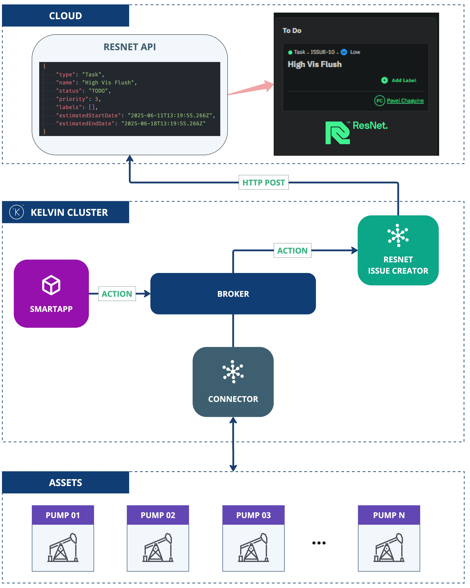

# Resnet Issue Creator - Custom Actions
This application demonstrates the use of the Kelvin SDK for handling custom actions.

The application listens for custom actions and creates issues in Resnet based on the received data.

# Architecture Diagram
The following diagram illustrates the architecture of the solution:



# Requirements
1. Python 3.9 or higher
2. Install Kelvin SDK: `pip3 install kelvin-sdk`
3. Install project dependencies: `pip3 install -r requirements.txt`
4. Docker (optional) for upload the application to Kelvin Cloud.

# Local Usage
1. Define the Resnet configurations in `app.yaml`:

```yaml
defaults:
  # Application Configuration Default Values
  configuration:
    url: <resnet_url>
    tenant: <tenant_id>
    api_key: <api_key>
```
2. **Run** the application: `python3 main.py`
3. Open a new terminal and **Test** with generator: `kelvin app test generator --entrypoint tests/generator.py:CustomActionGenerator`