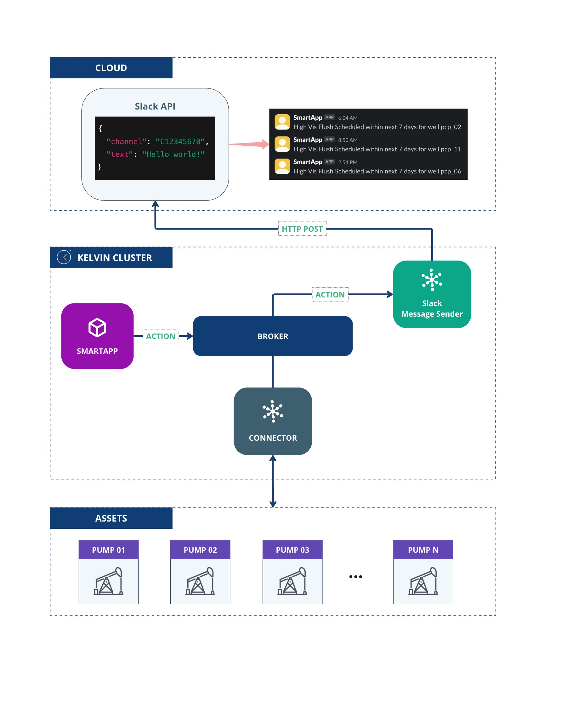

# Slack Message Sender - Custom Actions
This application demonstrates the use of the Kelvin SDK for handling custom actions.

The application listens for `Slack Message` custom actions and sends Slack messages to a given channel.

# Architecture Diagram
The following diagram illustrates the architecture of the solution:



# Slack API Setup Requirements

Before using this application to send messages to Slack, you need to set up a Slack App with the correct permissions. Follow the steps below:

## 1. Create a Slack App

1. Go to the [Slack API Apps Dashboard](https://api.slack.com/apps)
2. Click **"Create New App"**
3. Choose **"From scratch"**
4. Name your app (e.g. `MessageBot`) and select the workspace
5. Click **"Create App"**

## 2. Configure OAuth Scopes

1. In the left-hand menu, go to **"OAuth & Permissions"**
2. Under **Bot Token Scopes**, click **"Add an OAuth Scope"**
3. Add the following scopes (at minimum):

| Scope           | Description                                                   |
|------------------|--------------------------------------------------------------|
| `channels:join`  | Join public channels in a workspace                          |
| `channels:read`  | View basic information about public channels in a workspace  |
| `chat:write`     | Send messages                                                |
| `groups:read`    | View basic information about private channels                |
| `im:read`        | View basic information about direct messages                 |
| `mpim:read`      | View basic information about group direct messages           |

## 3. Install the App to Your Workspace

1. Still in **OAuth & Permissions**, under **OAuth Tokens**
2. Click **"Install App to Workspace"**
3. Copy the **Bot User OAuth Token** (e.g. `xoxb-...`) as it's going to be used to configure your Slack Message Sender instance

# Requirements
1. Python 3.9 or higher
2. Install Kelvin SDK: `pip3 install kelvin-sdk`
3. Install project dependencies: `pip3 install -r requirements.txt`
4. Docker (optional) for upload the application to Kelvin Cloud.

# Local Usage
1. Define the **Bot User OAuth Token** configuration in the `app.yaml`:

```yaml
defaults:
  # Application Configuration Default Values
  configuration:
    token: <% secrets.slack-bot-token %>
```
2. **Run** the application: `python3 main.py`
3. Open a new terminal and **Test** with generator: `kelvin app test generator --entrypoint tests/generator.py:CustomActionGenerator`