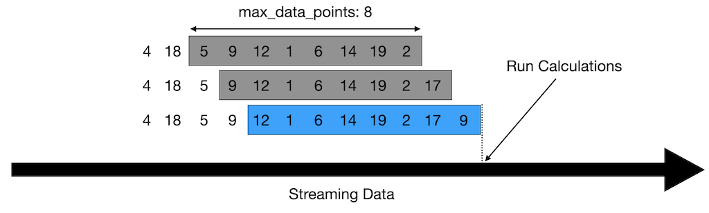
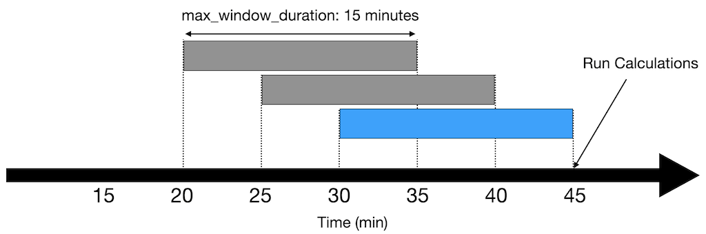

# Rolling Window DataFrame
This application demonstrates the usage of the Kelvin SDK to implement a rolling window of data points using Pandas.

The code dynamically processes incoming data streams and appends the data points to a Pandas DataFrame for each asset. The window can be configured to have a fixed size (number of data points) or a fixed time window. 

The code is also structured to support multiple assets with multiple data streams per asset.

## Max Data Points


## Max Window Duration


# Requirements
1. Python 3.8 or higher
2. Install Kelvin SDK: `pip3 install kelvin-sdk`
3. Install project dependencies: `pip3 install -r requirements.txt`
4. Docker (optional) for upload the application to a Kelvin Instance.

# Usage
1. Modify the `main.py` file to configure the Rolling Window parameters.
```python
rolling_window = RollingWindow(
    max_window_duration=300,  # max of 5 minutes of data
    max_data_points=10,  # max of 10 data points
    timestamp_rounding_interval=timedelta(seconds=1),  # round to the nearest second
)
```

2. Run the application: `python3 main.py`
3. Open a new terminal and test with the provided CSV file: `kelvin app test csv --csv csv/data.csv --asset-count 1 --publish-rate 1`


<video controls>
  <source src="assets/usage.mp4" type="video/mp4">
</video>

# Python Unit Tests
Run the unit tests: `python3 -m unittest discover -s tests/`