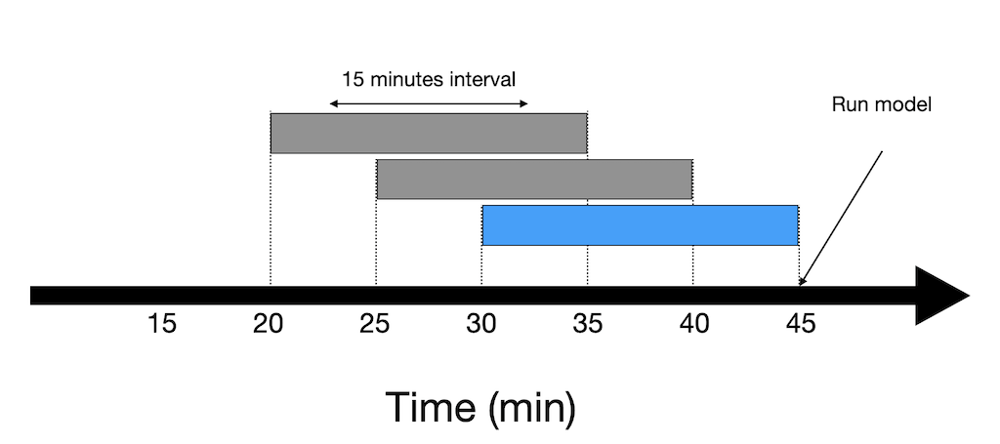

# Rolling Window DataFrame
This application demonstrates the usage of the Kelvin SDK to implement a rolling window of data points using Pandas.

The code dynamically processes incoming data streams and appends the data points to a Pandas DataFrame for each asset. The buffer can be configured to have a fixed size (number of points) or a fixed time window. 

The code is structured to support multiple assets with multiple data streams per asset.

# Requirements
1. Python 3.8 or higher
2. Install Kelvin SDK: `pip3 install kelvin-sdk`
3. Install project dependencies: `pip3 install -r requirements.txt`
4. Docker (optional) for upload the application to a Kelvin Instance.

# Usage
1. Run the application: `python3 main.py`
2. Open a new terminal and test with the provided CSV file: `kelvin app test csv --csv csv/data.csv --asset-count 1 --publish-rate 1`

<video controls>
  <source src="assets/demo.mp4" type="video/mp4">
</video>